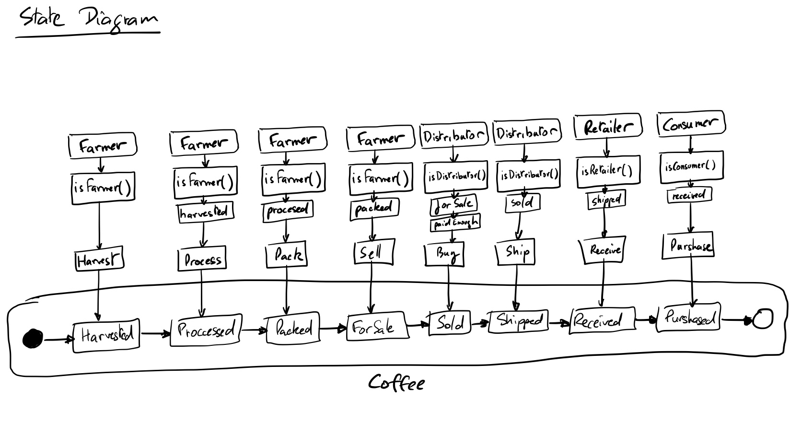
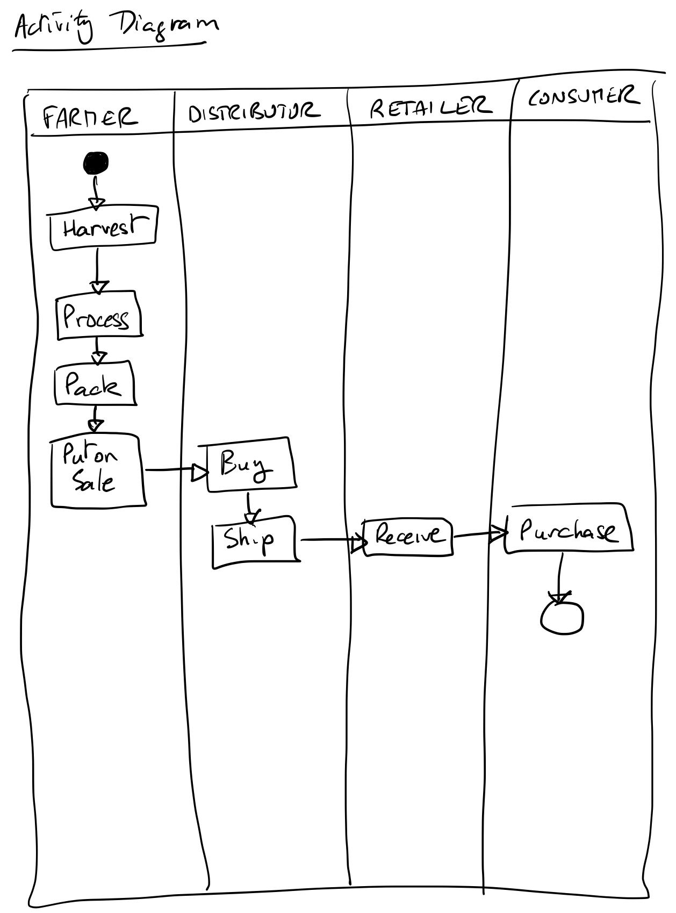
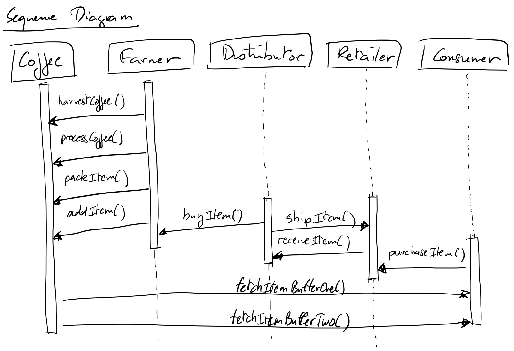
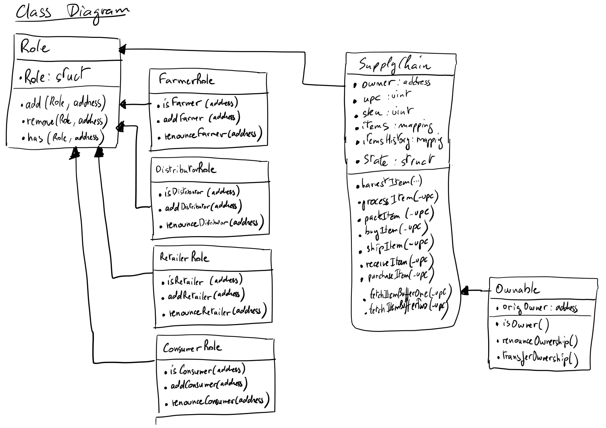

# Udacity Supply chain project

Ethereum DApp that demonstrates a Supply Chain flow between a Seller and Buyer. The user story is similar to any commonly used supply chain process. A Seller can add items to the inventory system stored in the blockchain. A Buyer can purchase such items from the inventory system. Additionally a Seller can mark an item as Shipped, and similarly a Buyer can mark an item as Received.

## UML Diagrams

## Contracts deployed on Rinkeby & TransactionIDs

* Migrations: 		0x91E5d5bbE5b886a43c84969a1e7f2924d56B8e55, TrxID: 0xa9754f5d4f5c0b7b9c544b4377c53aca75d5f0231d5ce550ad3e76b2e5939e94 
* FarmerRole: 		0x5b6AAc720748B26605CAc81345e84CC6e0404B45, TrxID: 0x88ecf61a23ce4c241ddb4e0df47806ed192785fb27fc064ada12630ec54a15ec
* DistributorRole: 	0x00A37FcDC05eF1f82e592Ca271d215b432F2cCAE, TrxID: 0x7932238c3ca73502339b525ee18b136c54c7fc18e06a956cb9e59d3ce02239a9
* RetailerRole: 	0x1F20930EfAdBCF0f2B566C4fc1a617916b125109, TrxID: 0x800eb1c6ca0a97c9ae089b242c007f082d19e01b5e6445108efd4b56ec387505
* ConsumerRole: 	0x8b99Cb66e1366375109280d829f4bF83e7F85DFE, TrxID: 0xd34514a94289566005ac921cc6a7b662817bb50a2bd4b5b842b73df48574f83f
* SupplyChain:		0x8b99Cb66e1366375109280d829f4bF83e7F85DFE, TrxID: 0x191eb88475d7815b5ccaf565a45c8f5075cb6acf5f6b6d9df74f28c8e4fd9667

### Libraries used in this project

* truffle-hdwallet-provider
* web3 v0.18.4 

## Built With

* [Ethereum](https://www.ethereum.org/) - Ethereum is a decentralized platform that runs smart contracts
* [Truffle Framework](http://truffleframework.com/) - Truffle is the most popular development framework for Ethereum with a mission to make your life a whole lot easier.

## Acknowledgments

* Solidity
* Ganache-cli
* Truffle
